# PROJECT CONTEXT - BAO CHAU NOIBO SYSTEM

Tài liệu này cung cấp cái nhìn toàn diện về kiến trúc, công nghệ, database, phân quyền, và các quy tắc nghiệp vụ của dự án Bảo Châu Nội Bộ (it07-00/baochau-noibo) dành cho nhà phát triển và AI coding agents.

---

## 1. Tổng quan dự án
- **Tên dự án**: Hệ thống Quản lý Nội bộ Bảo Châu (Bao Chau Noibo ERP).
- **Mục tiêu**: Số hóa và tự động hóa toàn bộ quy trình vận hành nội bộ của công ty dịch vụ môi trường, từ theo dõi báo giá, ký kết hợp đồng, phân công nhân sự, quản lý nhà thầu phụ, thanh toán, hoa hồng, chấm công, quản lý hồ sơ nhân sự, lịch công tác, kế hoạch marketing đến hệ thống báo cáo KPI đa chiều.
- **Đối tượng sử dụng**: 
  - Ban Giám đốc (`giam-doc`): Giám sát toàn bộ hoạt động kinh doanh, tài chính và tiến độ vận hành.
  - Bộ phận Kinh doanh (`kinh-doanh`, `tp-kinh-doanh`): Tiếp cận khách hàng, tạo báo giá, quản lý mục tiêu doanh số, hợp đồng và hoa hồng.
  - Bộ phận Vận hành (`tu-van`, `ky-thuat`): Nhận phân công công việc, cập nhật tiến độ thực hiện hồ sơ hoặc khảo sát hiện trường theo các bước workflow quy chuẩn.
  - Bộ phận Kế toán (`ke-toan`): Quản lý dòng tiền, theo dõi công nợ khách hàng, thực hiện thanh toán hoa hồng và kiểm soát hóa đơn tài chính.
  - Bộ phận Hành chính Nhân sự (`hcns`): Chấm công hàng tháng, quản lý hồ sơ nhân sự, hợp đồng lao động và tài liệu văn phòng.
  - Bộ phận Marketing (`marketing`): Quản lý kế hoạch nội dung truyền thông.
  - Quản trị hệ thống (`it`): Quản lý người dùng, phân quyền, cài đặt hệ thống và bảo trì.
- **Vấn đề dự án giải quyết**: 
  - Loại bỏ việc theo dõi thủ công qua excel phân mảnh bằng cách tập trung hóa dữ liệu khách hàng và 6 loại hợp đồng dịch vụ đặc thù.
  - Tự động hóa việc trích xuất file báo giá Word (.docx) chuyên nghiệp theo 8 mẫu biểu chuẩn mực dựa trên dữ liệu nhập sẵn, giảm sai sót và tiết kiệm thời gian.
  - Tự động hóa chấm công bằng cách đọc trực tiếp log thô từ máy chấm công vân tay/khuôn mặt, giải quyết các bài toán đi muộn, về sớm, tính công chính xác.
  - Tự động hóa đồng bộ công nợ nhà cung cấp từ Google Sheet chung về hệ thống quản lý.
  - Đơn giản hóa việc thanh toán hoa hồng nhờ tích hợp sinh mã thanh toán QR VietQR tự động.

*Nguồn tham chiếu: [composer.json](file:///c:/laragon/www/laravel/composer.json), [web.php](file:///c:/laragon/www/laravel/routes/web.php), [SidebarMenu.php](file:///c:/laragon/www/laravel/app/Support/SidebarMenu.php), [Role.php](file:///c:/laragon/www/laravel/app/Enums/Role.php), [Permission.php](file:///c:/laragon/www/laravel/app/Enums/Permission.php).*

---

## 2. Công nghệ
- **Phiên bản PHP**: `^8.3` (Nguồn: [composer.json](file:///c:/laragon/www/laravel/composer.json#L9)).
- **Phiên bản Laravel**: `^13.0` (Nguồn: [composer.json](file:///c:/laragon/www/laravel/composer.json#L11)).
- **Database**: SQLite (mặc định trong phát triển/kiểm thử local, Nguồn: [.env.example](file:///c:/laragon/www/laravel/.env.example#L26)). Hệ thống sử dụng Eloquent ORM và hỗ trợ MySQL/PostgreSQL thông qua cấu hình chuẩn của Laravel.
- **Frontend**: Livewire v4 (Nguồn: [composer.json](file:///c:/laragon/www/laravel/composer.json#L14)) cho phép tương tác thời gian thực không cần reload trang nhờ tích hợp `wire:navigate`.
- **CSS Framework**: TailwindCSS v4.0 (Nguồn: [package.json](file:///c:/laragon/www/laravel/package.json#L14)).
- **Package quan trọng**:
  - `spatie/laravel-permission` (Quản lý phân quyền Role-Based Access Control).
  - `spatie/laravel-activitylog` (Theo dõi và ghi nhận lịch sử thay đổi dữ liệu của các Model).
  - `opcodesio/log-viewer` (Giao diện quản lý log hệ thống).
  - `barryvdh/laravel-dompdf` (Hỗ trợ sinh file PDF).
  - `phpoffice/phpword` (Đọc và ghi đè nội dung file Word mẫu .docx để xuất báo giá).
  - `phpoffice/phpspreadsheet` (Xuất báo cáo chấm công dạng Excel).
  - `mews/purifier` (Lọc và làm sạch mã HTML chống XSS).
- **Công cụ build**: Vite v8 (Nguồn: [package.json](file:///c:/laragon/www/laravel/package.json#L15)).
- **Môi trường triển khai**: Phù hợp chạy trên Laragon (Local Windows), Shared Hosting hoặc VPS Linux (hệ thống có sẵn file [.htaccess](file:///c:/laragon/www/laravel/public/.htaccess) cấu hình redirect xiên và [Procfile](file:///c:/laragon/www/laravel/Procfile)).

---

## 3. Kiến trúc
- **Kiểu kiến trúc**: Hướng sự kiện (Event-Driven) kết hợp cấu trúc Service-Repository & Action Layer bên dưới mô hình MVC chuẩn của Laravel.
- **Cách tổ chức source code**:
  - **Routes**: Định nghĩa tập trung trong [web.php](file:///c:/laragon/www/laravel/routes/web.php) (tất cả các route nghiệp vụ đều được nhóm dưới middleware `auth` và `active` kiểm tra trạng thái hoạt động của user).
  - **Livewire Components**: Đặt trong [app/Livewire/Admin](file:///c:/laragon/www/laravel/app/Livewire/Admin) quản lý giao diện tương tác động cho từng module.
  - **Models**: Đặt trong [app/Models](file:///c:/laragon/www/laravel/app/Models). Hầu hết các Model quan trọng đều tích hợp Trait `SoftDeletes` và `LogsActivity` để ghi vết chỉnh sửa (Nguồn: [Customer.php](file:///c:/laragon/www/laravel/app/Models/Customer.php#L13), [HasContractBehavior.php](file:///c:/laragon/www/laravel/app/Models/Concerns/HasContractBehavior.php#L22)).
  - **Enums**: Đặt trong [app/Enums](file:///c:/laragon/www/laravel/app/Enums), quản lý chặt chẽ trạng thái và danh sách quyền/role của hệ thống.
  - **Services**: Nằm tại [app/Services](file:///c:/laragon/www/laravel/app/Services), xử lý logic nghiệp vụ tách biệt:
    - [AttendanceService.php](file:///c:/laragon/www/laravel/app/Services/AttendanceService.php): Tính toán giờ công, đi muộn, về sớm từ file chấm công.
    - [QuotationDocumentExportService.php](file:///c:/laragon/www/laravel/app/Services/Quotations/QuotationDocumentExportService.php): Chèn dữ liệu động vào file template Word XML.
    - [ViettelPostService.php](file:///c:/laragon/www/laravel/app/Services/ViettelPostService.php): Tích hợp tạo và tra cứu đơn vận chuyển qua ViettelPost API.
    - [ContractNccPaymentSheetSyncService.php](file:///c:/laragon/www/laravel/app/Services/ContractNccPaymentSheetSyncService.php) & [GoogleSheetTotalExtractor.php](file:///c:/laragon/www/laravel/app/Services/GoogleSheetTotalExtractor.php): Đồng bộ chi phí nhà cung cấp bằng cách cào dữ liệu từ link Google Sheets công khai.
    - [StatisticsService.php](file:///c:/laragon/www/laravel/app/Services/StatisticsService.php): Tổng hợp báo cáo, biểu đồ doanh số doanh thu.
  - **Actions**: Nằm tại [app/Actions](file:///c:/laragon/www/laravel/app/Actions) để đóng gói các logic cập nhật/thêm mới dữ liệu dùng chung (e.g., `UpsertContractWasteAction`).
- **Quy ước đặt tên**:
  - Model: PascalCase, số ít (e.g., `QuotationDocument`).
  - Table: snake_case, số nhiều (e.g., `quotation_documents`).
  - Livewire: PascalCase, hậu tố `Manager` hoặc `Form` (e.g., `CustomerManager`, `CommissionRequestForm`).
  - Route: Tiền tố `app.`, phân cấp bằng dấu chấm, sử dụng tiếng Anh hoặc tiếng Việt không dấu (e.g., `app.contracts.waste.index`).

---

## 4. Các module

### 4.1. Quản lý Hợp đồng (Contracts)
- **Mục đích**: Lưu trữ thông tin pháp lý, giá trị hợp đồng, hoa hồng đối tác, doanh số thực nhận, link Google Sheet thanh toán nhà thầu phụ (NCC), tiến độ thanh toán của khách hàng, tiến độ thực hiện hồ sơ (6 bước), và tài liệu nghiệm thu.
- **Route**: [web.php L119-126](file:///c:/laragon/www/laravel/routes/web.php#L119-L126).
- **Model & Table tương ứng**:
  - Chất thải & Tiếng ồn: [ContractWaste.php](file:///c:/laragon/www/laravel/app/Models/ContractWaste.php) -> bảng `contract_wastes`
  - Pháp lý & Hồ sơ môi trường: [ContractLegal.php](file:///c:/laragon/www/laravel/app/Models/ContractLegal.php) (table định nghĩa: `contract_consultings`)
  - Kỹ thuật & Ứng phó sự cố: [ContractTechnical.php](file:///c:/laragon/www/laravel/app/Models/ContractTechnical.php) (table định nghĩa: `contract_projects`)
  - Nghiên cứu & Chuyển đổi công nghệ: [ContractResearch.php](file:///c:/laragon/www/laravel/app/Models/ContractResearch.php) (table định nghĩa: `contract_commercials`)
  - Tư vấn & Báo cáo PTBV: [ContractSustainability.php](file:///c:/laragon/www/laravel/app/Models/ContractSustainability.php) -> bảng `contract_sustainabilities`
  - Phát thải & Năng lượng: [ContractEmission.php](file:///c:/laragon/www/laravel/app/Models/ContractEmission.php) (table định nghĩa: `contract_energies`)
- **Shared Behaviors**: Tất cả 6 Model hợp đồng đều sử dụng Trait [HasContractBehavior.php](file:///c:/laragon/www/laravel/app/Models/Concerns/HasContractBehavior.php) để dùng chung các mối quan hệ: `customer`, `handler` (nhà thầu phụ), `staff` (kinh doanh phụ trách), `department`, và các quan hệ đa hình (`assignments`, `workflowSteps`, `milestoneFiles`, `paymentSchedules`).
- **Trạng thái hoàn thiện**: Đã hoàn chỉnh.

### 4.2. Báo giá & Biên dịch Báo giá (Quotations & Quotation Documents)
- **Mục đích**: Lưu thông tin khách hàng, dịch vụ yêu cầu, giá trị dự toán gốc, giá trị hợp đồng thực tế, và chiết khấu. Cho phép soạn thảo báo giá dưới dạng cấu trúc bảng chi tiết (sections & rows) và tự động xuất ra file Word/PDF dựa trên 8 template lưu sẵn trong thư mục [resources/templates/quotations](file:///c:/laragon/www/laravel/resources/templates/quotations).
- **Route**: [web.php L139-150](file:///c:/laragon/www/laravel/routes/web.php#L139-L150).
- **Model**: [Quotation.php](file:///c:/laragon/www/laravel/app/Models/Quotation.php), [QuotationDocument.php](file:///c:/laragon/www/laravel/app/Models/QuotationDocument.php), [QuotationDocumentItem.php](file:///c:/laragon/www/laravel/app/Models/QuotationDocumentItem.php), [QuotationDocumentSection.php](file:///c:/laragon/www/laravel/app/Models/QuotationDocumentSection.php), [QuotationDocumentSectionRow.php](file:///c:/laragon/www/laravel/app/Models/QuotationDocumentSectionRow.php), [QuotationFile.php](file:///c:/laragon/www/laravel/app/Models/QuotationFile.php).
- **Trạng thái hoàn thiện**: Đã hoàn chỉnh.

### 4.3. Quản lý Chấm công (Attendance)
- **Mục đích**: Nhập file log từ máy chấm công (ZKTeco/dat/txt/log/csv), phân tích log checkin-checkout theo khung giờ hành chính `08:00 - 17:00` (trừ Chủ nhật) để tính số ngày công, phút đi muộn, phút về sớm, giờ làm thêm (overtime). Hỗ trợ xuất Excel báo cáo tổng hợp và báo cáo chi tiết cho từng nhân viên.
- **Route**: [web.php L196-199](file:///c:/laragon/www/laravel/routes/web.php#L196-L199).
- **Livewire & Controller**: [AttendanceManager.php](file:///c:/laragon/www/laravel/app/Livewire/Admin/Attendance/AttendanceManager.php), [AttendanceEmployeeManager.php](file:///c:/laragon/www/laravel/app/Livewire/Admin/Attendance/AttendanceEmployeeManager.php), [AttendanceExportController.php](file:///c:/laragon/www/laravel/app/Http/Controllers/Admin/AttendanceExportController.php).
- **Model**: [AttendanceEmployee.php](file:///c:/laragon/www/laravel/app/Models/AttendanceEmployee.php), [AttendanceLog.php](file:///c:/laragon/www/laravel/app/Models/AttendanceLog.php), [AttendanceImport.php](file:///c:/laragon/www/laravel/app/Models/AttendanceImport.php).
- **Trạng thái hoàn thiện**: Đã hoàn chỉnh.

### 4.4. Yêu cầu chi Hoa hồng (Commissions)
- **Mục đích**: Kinh doanh lập yêu cầu chi tiền hoa hồng cho cộng tác viên, người giới thiệu dựa trên hợp đồng đã ký. Hệ thống tự động tạo mã VietQR động chứa số tài khoản nhận, số tiền, tên người nhận và nội dung chuyển khoản được định dạng sẵn (e.g. `Chi hoa hong HD <So_HD>`).
- **Route**: [web.php L107-111](file:///c:/laragon/www/laravel/routes/web.php#L107-L111).
- **Livewire**: [CommissionRequestManager.php](file:///c:/laragon/www/laravel/app/Livewire/Admin/Commissions/CommissionRequestManager.php), [CommissionRequestForm.php](file:///c:/laragon/www/laravel/app/Livewire/Admin/Commissions/CommissionRequestForm.php).
- **Model**: [CommissionRequest.php](file:///c:/laragon/www/laravel/app/Models/CommissionRequest.php).
- **Trạng thái hoàn thiện**: Đã hoàn chỉnh.

### 4.5. Chuyển phát thư từ (Postal Deliveries)
- **Mục đích**: Theo dõi hồ sơ gửi đi cho khách hàng hoặc đối tác. Tích hợp trực tiếp với Viettel Post API để tạo mã vận đơn, tính toán cước phí và tự động tra cứu trạng thái đơn hàng.
- **Route**: [web.php L136](file:///c:/laragon/www/laravel/routes/web.php#L136).
- **Livewire**: [PostalDeliveryManager.php](file:///c:/laragon/www/laravel/app/Livewire/Admin/PostalDeliveries/PostalDeliveryManager.php).
- **Model**: [PostalDelivery.php](file:///c:/laragon/www/laravel/app/Models/PostalDelivery.php).
- **Trạng thái hoàn thiện**: Đã hoàn chỉnh.

### 4.6. Quản lý Nhân sự (HCNS / HR)
- **Mục đích**: HCNS quản lý thông tin lý lịch nhân viên (Mã nhân viên, CCCD, ngày cấp, MST cá nhân, số sổ BHXH, thông tin liên hệ khẩn cấp, tài khoản ngân hàng, trình độ học vấn). Đồng thời theo dõi hợp đồng lao động (`EmployeeContract`) và lưu trữ file tài liệu cá nhân đính kèm (`EmployeeDocument`).
- **Route**: [web.php L202-205](file:///c:/laragon/www/laravel/routes/web.php#L202-L205).
- **Livewire**: [HrProfileManager.php](file:///c:/laragon/www/laravel/app/Livewire/Admin/Hr/HrProfileManager.php), [HrProfileDetail.php](file:///c:/laragon/www/laravel/app/Livewire/Admin/Hr/HrProfileDetail.php).
- **Model**: [User.php](file:///c:/laragon/www/laravel/app/Models/User.php), [EmployeeContract.php](file:///c:/laragon/www/laravel/app/Models/EmployeeContract.php), [EmployeeDocument.php](file:///c:/laragon/www/laravel/app/Models/EmployeeDocument.php).
- **Trạng thái hoàn thiện**: Đã hoàn chỉnh.

---

## 5. Nghiệp vụ hiện tại

Hệ thống vận hành theo chuỗi liên kết các nghiệp vụ thực tế như sau:

```
[Kinh doanh tìm cơ hội] ──> [Tạo báo giá tự động (QuotationDocument)] 
                                        │
                                        ▼ (Khi KH chốt & Chọn "Ký hợp đồng")
[Phân loại hợp đồng (1 trong 6 bảng)] <─┘
         │
         ▼
[Phân công nhân sự thực hiện (ContractAssignment)]
         │
         ▼
[Cập nhật tiến độ kỹ thuật (Workflow 6 bước)] ──> [Đính kèm tài liệu bàn giao (MilestoneFiles)]
         │
         ▼ (Mỗi đợt nghiệm thu/thanh toán)
[Lập kế hoạch thanh toán (PaymentSchedule)] ──> [Cập nhật chứng từ (VoucherStatus - Hóa đơn/Bàn giao)]
         │
         ├─> [Cào nợ NCC tự động từ link Google Sheet] ──> [Cập nhật doanh thu thực tế]
         │
         ▼ (Sau khi thu tiền từ KH)
[Kinh doanh đề xuất hoa hồng (CommissionRequest)] ──> [Kế toán/Sếp duyệt] ──> [Quét VietQR chuyển khoản]
         │
         ▼ (Định kỳ)
[Theo dõi tái ký hợp đồng (RenewalStatus)]
```

### Chi tiết các bước:
1. **Báo giá**: Kinh doanh tạo báo giá trong [QuotationManager.php](file:///c:/laragon/www/laravel/app/Livewire/Admin/Quotations/QuotationManager.php) (Opportunity). Để in gửi khách hàng, họ tạo `QuotationDocument` chứa các hạng mục đơn giá và chọn template phù hợp. File Word/PDF được tự động sinh ra.
2. **Ký Hợp đồng**: Khi trạng thái Quotation chuyển thành `KY_HOP_DONG` (Nguồn: [QuotationStatus.php](file:///c:/laragon/www/laravel/app/Enums/QuotationStatus.php#L10)), dữ liệu được chuyển sang bảng Hợp đồng tương ứng.
3. **Phân công & Vận hành**: Trưởng phòng hoặc IT thực hiện phân công nhân sự (`ContractAssignment.php`). Kỹ thuật/Tư vấn phụ trách sẽ tiến hành hồ sơ và cập nhật trạng thái qua 6 bước (nhận -> khảo sát -> soạn thảo -> khách duyệt -> khách chốt -> hoàn thành) (Nguồn: [ContractWorkflowStep.php](file:///c:/laragon/www/laravel/app/Models/ContractWorkflowStep.php#L23)).
4. **Kế hoạch thanh toán**: Mỗi hợp đồng có nhiều đợt thanh toán được lên kế hoạch trước trong `ContractPaymentSchedule`. Kế toán theo dõi hóa đơn và biên bản nghiệm thu (`voucher_status`).
5. **Chi phí thầu phụ**: Nếu dự án có thuê ngoài (NCC/Chủ xử lý), kinh doanh điền link Google Sheet quản lý chi phí. Hệ thống chạy cronjob hàng giờ hoặc ấn nút đồng bộ để kéo giá trị thanh toán thực tế về trường `ncc_payment`.
6. **Quyết toán hoa hồng**: Khi nhận được tiền từ khách hàng, Kinh doanh tạo đề xuất chi hoa hồng. Khi kế toán hoặc Giám đốc duyệt, mã QR VietQR được dùng để thanh toán ngay.
7. **Tái ký**: Với hợp đồng Chất thải hoặc Quan trắc định kỳ, hệ thống sẽ cảnh báo khi đến hạn để kinh doanh thực hiện quy trình tái ký hợp đồng mới.

---

## 6. Database

### Bảng quan trọng & Mục đích:
- `users`: Thông tin tài khoản nhân viên, trạng thái hoạt động (`is_active`), liên kết phòng ban (`department_id`) và các trường hồ sơ HR. (Nguồn: [User.php](file:///c:/laragon/www/laravel/app/Models/User.php)).
- `departments`: Các phòng ban (admin, ban-giam-doc, kinh-doanh, tu-van-cskh, ky-thuat, marketing, ke-toan, hcns). (Nguồn: [Department.php](file:///c:/laragon/www/laravel/app/Models/Department.php)).
- `customers`: Thông tin khách hàng (tên, slug, mã số thuế, địa chỉ, tỉnh thành). (Nguồn: [Customer.php](file:///c:/laragon/www/laravel/app/Models/Customer.php)).
- `handlers`: Nhà thầu phụ/Chủ xử lý phục vụ các dự án thầu phụ. (Nguồn: [Handler.php](file:///c:/laragon/www/laravel/app/Models/Handler.php)).
- **6 Bảng hợp đồng**:
  - `contract_wastes`: Hợp đồng chất thải. Có trường số hợp đồng CXL (`shd_cxl`), số hợp đồng Bảo Châu (`shd_bc`), loại chất thải (`waste_type`), loại dịch vụ (`service_type`), địa chỉ thực hiện, v.v. (Nguồn: [ContractWaste.php](file:///c:/laragon/www/laravel/app/Models/ContractWaste.php)).
  - `contract_consultings`: Hợp đồng tư vấn/hồ sơ môi trường.
  - `contract_projects`: Hợp đồng kỹ thuật/ứng phó sự cố.
  - `contract_commercials`: Hợp đồng nghiên cứu khoa học.
  - `contract_sustainabilities`: Hợp đồng phát triển bền vững (ESG, CBAM).
  - `contract_energies`: Hợp đồng tiết kiệm năng lượng/solar.
- `contract_assignments` (Đa hình): Lưu trữ phân công kỹ thuật viên/tư vấn viên phụ trách thực hiện hợp đồng (`assignable_type` và `assignable_id`). (Nguồn: [ContractAssignment.php](file:///c:/laragon/www/laravel/app/Models/ContractAssignment.php)).
- `contract_workflow_steps` (Đa hình): Lưu vết lịch sử chuyển bước tiến độ dự án. (Nguồn: [ContractWorkflowStep.php](file:///c:/laragon/www/laravel/app/Models/ContractWorkflowStep.php)).
- `contract_milestone_files` (Đa hình): File nghiệm thu đính kèm theo từng bước tiến độ. (Nguồn: [ContractMilestoneFile.php](file:///c:/laragon/www/laravel/app/Models/ContractMilestoneFile.php)).
- `contract_payment_schedules` (Đa hình): Các đợt thanh toán, số tiền, ngày hạn thanh toán và trạng thái thanh toán (`pending`, `partial`, `paid`, `overdue`). (Nguồn: [ContractPaymentSchedule.php](file:///c:/laragon/www/laravel/app/Models/ContractPaymentSchedule.php)).
- `commission_requests` (Đa hình): Yêu cầu chi hoa hồng cho đối tác, liên kết đa hình với hợp đồng (`contract_type`, `contract_id`). (Nguồn: [CommissionRequest.php](file:///c:/laragon/www/laravel/app/Models/CommissionRequest.php)).
- `quotations`: Bảng theo dõi cơ hội kinh doanh. (Nguồn: [Quotation.php](file:///c:/laragon/www/laravel/app/Models/Quotation.php)).
- `quotation_documents`: Bản ghi tài liệu báo giá được biên soạn chi tiết. (Nguồn: [QuotationDocument.php](file:///c:/laragon/www/laravel/app/Models/QuotationDocument.php)).
- `quotation_document_sections` & `quotation_document_section_rows`: Chứa dữ liệu bảng biểu động phục vụ việc render báo giá phức tạp.
- `attendance_employees`: Danh sách nhân sự máy chấm công (`device_uid`).
- `attendance_logs`: Lịch sử checkin/checkout của nhân viên.
- `attendance_imports`: Ghi nhận phiên import file chấm công.
- `daily_reports`: Báo cáo ngày của nhân viên.
- `work_schedules` & `work_schedule_participants`: Sự kiện lịch làm việc và người liên quan.
- `employee_contracts` & `employee_documents`: Hợp đồng lao động và hồ sơ đính kèm của nhân viên.

### Soft Delete & Audit Log:
- Soft delete (`deleted_at`) được tích hợp trong tất cả các bảng cốt lõi như `customers`, `users`, `commission_requests`, và 6 bảng hợp đồng để tránh mất dữ liệu ngoài ý muốn.
- Ghi log hành động chỉnh sửa hoặc xóa dữ liệu qua `spatie/laravel-activitylog` được bật mặc định trên các model để quản lý (Nguồn: [ActivityLogViewer.php](file:///c:/laragon/www/laravel/app/Livewire/Admin/ActivityLogViewer.php)).

### Mermaid ERD:

```mermaid
erDiagram
    DEPARTMENTS ||--o{ USERS : "contains"
    USERS ||--o{ DAILY_REPORTS : "writes"
    USERS ||--o{ WORK_SCHEDULES : "creates"
    USERS ||--o{ COMMISSION_REQUESTS : "requests"
    USERS ||--o{ POSTAL_DELIVERIES : "sends"
    USERS ||--o{ EMPLOYEE_CONTRACTS : "has"
    USERS ||--o{ EMPLOYEE_DOCUMENTS : "submits"
    
    CUSTOMERS ||--o{ CONTRACT_WASTES : "signs"
    CUSTOMERS ||--o{ CONTRACT_CONSULTINGS : "signs"
    CUSTOMERS ||--o{ CONTRACT_PROJECTS : "signs"
    CUSTOMERS ||--o{ CONTRACT_COMMERCIALS : "signs"
    CUSTOMERS ||--o{ CONTRACT_SUSTAINABILITIES : "signs"
    CUSTOMERS ||--o{ CONTRACT_ENERGIES : "signs"
    
    HANDLERS ||--o{ CONTRACT_WASTES : "subcontracts"
    HANDLERS ||--o{ CONTRACT_CONSULTINGS : "subcontracts"
    
    CONTRACT_WASTES ||--o{ CONTRACT_ASSIGNMENTS : "polymorphic"
    CONTRACT_WASTES ||--o{ CONTRACT_WORKFLOW_STEPS : "polymorphic"
    CONTRACT_WASTES ||--o{ CONTRACT_PAYMENT_SCHEDULES : "polymorphic"
    CONTRACT_WASTES ||--o{ COMMISSION_REQUESTS : "polymorphic"
    
    CONTRACT_CONSULTINGS ||--o{ CONTRACT_ASSIGNMENTS : "polymorphic"
    CONTRACT_CONSULTINGS ||--o{ CONTRACT_WORKFLOW_STEPS : "polymorphic"
    CONTRACT_CONSULTINGS ||--o{ CONTRACT_PAYMENT_SCHEDULES : "polymorphic"
    CONTRACT_CONSULTINGS ||--o{ COMMISSION_REQUESTS : "polymorphic"

    QUOTATIONS ||--o{ QUOTATION_DOCUMENTS : "generates"
    QUOTATIONS ||--o{ QUOTATION_FILES : "attaches"
    QUOTATION_DOCUMENTS ||--o{ QUOTATION_DOCUMENT_ITEMS : "contains"
    QUOTATION_DOCUMENTS ||--o{ QUOTATION_DOCUMENT_SECTIONS : "has"
    QUOTATION_DOCUMENT_SECTIONS ||--o{ QUOTATION_DOCUMENT_SECTION_ROWS : "details"

    ATTENDANCE_EMPLOYEES ||--o{ ATTENDANCE_LOGS : "logs"
```



---

## 7. Authentication và phân quyền
- **Cơ chế xác thực**: Sử dụng Guard `web` mặc định của Laravel, đăng nhập bằng `username` và `password`. (Nguồn: [LoginController.php](file:///c:/laragon/www/laravel/app/Http/Controllers/Auth/LoginController.php), [EnsureUserIsActive.php](file:///c:/laragon/www/laravel/app/Http/Middleware/EnsureUserIsActive.php)).
- **Quản lý quyền hạn**:
  - Gán vai trò (`Role`) và quyền (`Permission`) qua Spatie Permission.
  - Sử dụng middleware alias `permission` và `role` để bảo vệ routes (Nguồn: [app.php L16-20](file:///c:/laragon/www/laravel/bootstrap/app.php#L16-L20)).
  - Bổ sung kiểm tra cứng trong middleware `CheckPermission.php`: Vai trò `it` (IT / Quản trị) mặc định bỏ qua mọi kiểm tra quyền (Super Admin) (Nguồn: [CheckPermission.php L26-28](file:///c:/laragon/www/laravel/app/Http/Middleware/CheckPermission.php#L26-L28)).
- **Phạm vi dữ liệu theo Role**:
  - **IT / Giám đốc**: Xem toàn bộ hợp đồng, báo giá, hoa hồng, chấm công của tất cả nhân viên.
  - **Trưởng phòng Kinh doanh**: Xem báo cáo tổng hợp kinh doanh, báo giá, mục tiêu doanh số của toàn bộ nhân viên thuộc phòng Kinh doanh.
  - **Nhân viên Kinh doanh**: Chỉ xem báo giá, doanh số cá nhân, yêu cầu hoa hồng do chính mình phụ trách. (Nguồn: [QuotationDocumentController.php L25-27](file:///c:/laragon/www/laravel/app/Http/Controllers/Admin/QuotationDocumentController.php#L25-L27)).
  - **Tư vấn / Kỹ thuật**: Chỉ xem các hợp đồng mà mình được phân công thực hiện (`ContractAssignment`). (Nguồn: [SidebarMenu.php L270-272](file:///c:/laragon/www/laravel/app/Support/SidebarMenu.php#L270-L272)).
  - **Kế toán**: Có quyền xem dòng tiền và hoa hồng của tất cả mọi người nhưng bị chặn không cho phép sửa đổi yêu cầu chi hoa hồng (chỉ có quyền Duyệt / Chi / Từ chối). (Nguồn: [CommissionRequestForm.php L52](file:///c:/laragon/www/laravel/app/Livewire/Admin/Commissions/CommissionRequestForm.php#L52)).

---

## 8. Quy tắc nghiệp vụ

### 8.1. Validation
- Ngày hiệu lực của hợp đồng phải lớn hơn hoặc bằng ngày ký. Ngày kết thúc hợp đồng phải lớn hơn hoặc bằng ngày hiệu lực. (Nguồn: [ContractValidation.php L109-110](file:///c:/laragon/www/laravel/app/Livewire/Concerns/ContractValidation.php#L109-L110)).
- Giá trị tiền tệ (hợp đồng, doanh số, hoa hồng) không được âm và được validate bằng filter `CleanMoneyInput` để loại bỏ dấu phân cách hàng nghìn trước khi validate số thực. (Nguồn: [CleanMoneyInput.php](file:///c:/laragon/www/laravel/app/Livewire/Concerns/CleanMoneyInput.php)).
- Báo giá phải thuộc loại hợp đồng được hỗ trợ trong hệ thống. (Nguồn: [CommissionRequestForm.php L200-201](file:///c:/laragon/www/laravel/app/Livewire/Admin/Commissions/CommissionRequestForm.php#L200-L201)).

### 8.2. Nghiệp vụ trạng thái (Workflow)
- Hoa hồng đối tác (`CommissionRequest`) có quy trình chuyển trạng thái nghiêm ngặt: `Dự chi` (Kinh doanh tạo mới/chỉnh sửa) -> `Đã duyệt` (Giám đốc duyệt) -> `Đã chi` (Kế toán chi tiền và cập nhật hóa đơn). (Nguồn: [CommissionRequestStatus.php](file:///c:/laragon/www/laravel/app/Enums/CommissionRequestStatus.php)).
- Kế toán không được phép chỉnh sửa thông tin yêu cầu chi hoa hồng của nhân viên, chỉ có quyền duyệt hoặc từ chối. (Nguồn: [CommissionRequestForm.php L52](file:///c:/laragon/www/laravel/app/Livewire/Admin/Commissions/CommissionRequestForm.php#L52)).
- Yêu cầu hoa hồng đã được duyệt hoặc đã chi thì không nhân viên nào được phép sửa. (Nguồn: [CommissionRequestForm.php L54-62](file:///c:/laragon/www/laravel/app/Livewire/Admin/Commissions/CommissionRequestForm.php#L54-L62)).

### 8.3. Cách tính công & Đi muộn về sớm
- Thời gian đi muộn tính từ sau `08:00` sáng.
- Thời gian về sớm tính nếu checkout trước `17:00` chiều.
- Một ngày công trọn vẹn (`1.0`) yêu cầu nhân viên làm đủ 8 tiếng thực tế sau khi trừ đi 60 phút nghỉ trưa (`workHours / 8`, cap tối đa là `1.0`). (Nguồn: [AttendanceService.php L123-128](file:///c:/laragon/www/laravel/app/Services/AttendanceService.php#L123-L128)).
- Ngày Chủ nhật được ký hiệu mặc định là `V` (nghỉ lễ). Ngày có checkin/checkout đầy đủ là `X`. Ngày nghỉ không lý do là `O` hoặc bỏ trống. (Nguồn: [AttendanceService.php L142](file:///c:/laragon/www/laravel/app/Services/AttendanceService.php#L142)).

---

## 9. Quy ước code
- **Đặt tên file**: PascalCase cho class, snake_case cho file view.
- **Xử lý Response**: Livewire trả về các view tương ứng kết hợp dispatch sự kiện Swal (`swal:toast`, `swal:success`) để hiển thị thông báo góc màn hình (Nguồn: [StatisticsBoard.php L75](file:///c:/laragon/www/laravel/app/Livewire/Admin/StatisticsBoard.php#L75)).
- **Validate dữ liệu**: Thực hiện validate ngay trong component Livewire thông qua thuộc tính `$this->validate()` trước khi lưu dữ liệu.
- **Lưu trữ file**: Sử dụng disk cấu hình qua env (`AVATAR_DISK` và `UPLOAD_DISK`). Mặc định lưu trữ trong thư mục `storage/app/public/` (Nguồn: [User.php L131](file:///c:/laragon/www/laravel/app/Models/User.php#L131), [QuotationDocumentExportService.php L48](file:///c:/laragon/www/laravel/app/Services/Quotations/QuotationDocumentExportService.php#L48)).
- **Ghi log**: Tất cả các Model cốt lõi kế thừa Spatie Activitylog và ghi vết chỉnh sửa dirty (`logOnlyDirty()`). (Nguồn: [Customer.php L19](file:///c:/laragon/www/laravel/app/Models/Customer.php#L19)).
- **Xử lý lỗi**: Sử dụng khối `try-catch` và ghi log chi tiết lỗi kèm class cụ thể thông qua `Log::error()` hoặc `Log::warning()`. (Nguồn: [GoogleSheetTotalExtractor.php L58-62](file:///c:/laragon/www/laravel/app/Services/GoogleSheetTotalExtractor.php#L58-L62)).
- **Tạo mã tự động**: 
  - Mã báo giá (`document_number`) và mã khách hàng (`slug`) được sinh tự động bằng hàm Helper `Str::slug` kết hợp vòng lặp kiểm tra trùng lặp trong database (Nguồn: [Customer.php L37-54](file:///c:/laragon/www/laravel/app/Models/Customer.php#L37-L54)).

---

## 10. Tình trạng dự án
- **Phân loại**: **Đã hoàn chỉnh**.
- **Căn cứ**: Dự án có đầy đủ mã nguồn backend, frontend, seeders dữ liệu mẫu hoàn chỉnh, cấu hình phân quyền cho 9 role thực tế, các cronjob và scheduler hoạt động tự động, tích hợp thành công các API bên thứ ba (ViettelPost, VietQR) và hệ thống kiểm thử tự động (Feature/Unit tests) bao phủ hầu hết các module cốt lõi (Nguồn: [tests/Feature/Livewire/Admin/Contracts](file:///c:/laragon/www/laravel/tests/Feature/Livewire/Admin/Contracts)).

---

## 11. Rủi ro
- **Bảo mật**: 
  - Người dùng có vai trò `it` có quyền truy cập trực tiếp và cập nhật nội dung file cấu hình `.env` thông qua giao diện IT Dashboard trên trình duyệt (Nguồn: [StatisticsBoard.php L119-147](file:///c:/laragon/www/laravel/app/Livewire/Admin/StatisticsBoard.php#L119-L147)). Điều này gây rủi ro lộ lọt key nếu tài khoản IT bị chiếm quyền.
- **Mất dữ liệu**: 
  - Lệnh `db:backup` có chức năng tự động dọn dẹp các bản sao lưu cũ quá 30 ngày (Nguồn: [console.php L125](file:///c:/laragon/www/laravel/routes/console.php#L125)). Nếu hệ thống lưu trữ backup trên cùng ổ cứng với database chính, khi gặp sự cố phần cứng sẽ mất sạch dữ liệu.
- **Code trùng lặp**:
  - Giao diện của 6 loại hợp đồng và logic hiển thị các bảng báo cáo tương ứng có cấu trúc tương đối tương tự nhau nhưng đang được viết thành 6 file component Livewire riêng biệt. Điều này gây khó khăn khi cần thay đổi giao diện chung.
- **Query chậm**:
  - Việc cào dữ liệu Google Sheets đồng thời cho tất cả các hợp đồng thông qua lệnh cronjob hàng giờ sử dụng giao thức HTTP trực tiếp có thể gây nghẽn tiến trình queue nếu số lượng link Google Sheets quá lớn.

---

## 12. Hướng phát triển
- **Nguyên tắc**: Tận dụng triệt để trait [HasContractBehavior.php](file:///c:/laragon/www/laravel/app/Models/Concerns/HasContractBehavior.php) và class xuất báo giá [QuotationDocumentExportService.php](file:///c:/laragon/www/laravel/app/Services/Quotations/QuotationDocumentExportService.php). Không thay đổi cấu trúc database cũ để tránh lỗi tương thích ngược.
- **Đề xuất nâng cấp**:
  - Tối ưu hóa hiệu năng đồng bộ Google Sheets bằng cách chuyển đổi việc cào dữ liệu thành các Job bất đồng bộ xếp vào Queue thay vì cào đồng tuần tự trong lệnh Artisan.
  - Tích hợp thêm kênh thông báo tự động qua Zalo OA hoặc Telegram khi có yêu cầu chi hoa hồng mới cần duyệt.
  - Lưu trữ file xuất ra và tệp backup lên dịch vụ lưu trữ đám mây như AWS S3 thay vì lưu trữ cục bộ trên server (Nguồn: hỗ trợ sẵn package `league/flysystem-aws-s3-v3` trong composer.json).

---

## 13. Danh sách file quan trọng

| Đường dẫn file | Vai trò trong hệ thống |
| :--- | :--- |
| [web.php](file:///c:/laragon/www/laravel/routes/web.php) | Định nghĩa toàn bộ hệ thống định tuyến (routing) và kiểm soát phân quyền qua middleware. |
| [console.php](file:///c:/laragon/www/laravel/routes/console.php) | Thiết lập lịch trình chạy tự động (cronjobs) hằng ngày và hằng giờ cho hệ thống. |
| [Role.php](file:///c:/laragon/www/laravel/app/Enums/Role.php) | Danh sách vai trò và phân nhóm vai trò mặc định (Director, Sales, Tech). |
| [Permission.php](file:///c:/laragon/www/laravel/app/Enums/Permission.php) | Hệ thống mã quyền chi tiết cho tất cả các hành động CRUD trên các module. |
| [HasContractBehavior.php](file:///c:/laragon/www/laravel/app/Models/Concerns/HasContractBehavior.php) | Trait cốt lõi định nghĩa toàn bộ hành vi, casts và các mối quan hệ đa hình của hợp đồng. |
| [QuotationDocumentExportService.php](file:///c:/laragon/www/laravel/app/Services/Quotations/QuotationDocumentExportService.php) | Service biên dịch dữ liệu báo giá động vào file Word OpenXML (.docx) và PDF. |
| [AttendanceService.php](file:///c:/laragon/www/laravel/app/Services/AttendanceService.php) | Xử lý thuật toán phân tích chấm công thô từ máy chấm công để tính công và muộn/sớm. |
| [ViettelPostService.php](file:///c:/laragon/www/laravel/app/Services/ViettelPostService.php) | Service gọi API ngoài ViettelPost để quản lý và tra cứu vận đơn. |
| [GoogleSheetTotalExtractor.php](file:///c:/laragon/www/laravel/app/Services/GoogleSheetTotalExtractor.php) | Bóc tách và chuyển đổi dữ liệu số từ các file CSV Google Sheets công khai. |
| [SidebarMenu.php](file:///c:/laragon/www/laravel/app/Support/SidebarMenu.php) | Nguồn dữ liệu duy nhất cấu trúc sidebar động theo phân quyền của người dùng. |
