# BUSINESS WORKFLOW DIAGRAMS  
## Hệ thống quản lý nội bộ Bảo Châu

**Phiên bản tài liệu:** 1.0  
**Ngày lập:** 17/06/2026  
**Mục đích:** Chuẩn hóa toàn bộ luồng nghiệp vụ, trạng thái, vai trò và luồng dữ liệu của hệ thống nội bộ.

> **Quy ước**
>
> - **[Hiện có]**: Đã được mô tả trong `MASTER_PROJECT_PROMPT`.
> - **[Đề xuất]**: Nên bổ sung hoặc chuẩn hóa để các module vận hành xuyên suốt.
> - Tên model, bảng, route và permission phải được đối chiếu lại với repository trước khi sửa code.
> - Sáu model hợp đồng và sáu bảng hợp đồng hiện chưa có bảng ánh xạ chắc chắn trong tài liệu nguồn; không tự suy đoán ánh xạ khi phát triển.

---

# Mục lục sơ đồ

1. Bản đồ toàn hệ thống  
2. Luồng nghiệp vụ xuyên suốt  
3. Luồng tiếp nhận khách hàng  
4. Luồng chống trùng khách hàng  
5. Pipeline cơ hội kinh doanh  
6. Luồng lập báo giá  
7. Luồng duyệt báo giá  
8. Vòng đời trạng thái báo giá  
9. Luồng quản lý phiên bản báo giá  
10. Luồng chuyển báo giá thành hợp đồng  
11. Luồng định tuyến loại hợp đồng  
12. Luồng duyệt và ký hợp đồng  
13. Vòng đời trạng thái hợp đồng  
14. Luồng phân công thực hiện  
15. Workflow sáu bước hợp đồng  
16. Vòng đời một bước workflow  
17. Luồng hồ sơ và tài liệu  
18. Luồng thanh toán và công nợ  
19. Luồng chi phí nhà cung cấp  
20. Luồng đồng bộ Google Sheet  
21. Luồng yêu cầu chi hoa hồng  
22. Luồng đóng hợp đồng  
23. Luồng tái ký  
24. Luồng chấm công  
25. Luồng hồ sơ nhân sự  
26. Luồng báo cáo công việc hằng ngày  
27. Luồng chuyển phát Viettel Post  
28. Luồng thông báo và cảnh báo  
29. Luồng phân quyền truy cập  
30. Luồng nhật ký hoạt động  
31. Luồng xử lý ngoại lệ  
32. Sơ đồ dữ liệu tổng quan  
33. Sơ đồ trình tự từ báo giá đến hợp đồng  
34. Sơ đồ trình tự triển khai hợp đồng  
35. Sơ đồ trình tự thu tiền và chi hoa hồng  

---

# 1. Bản đồ toàn hệ thống

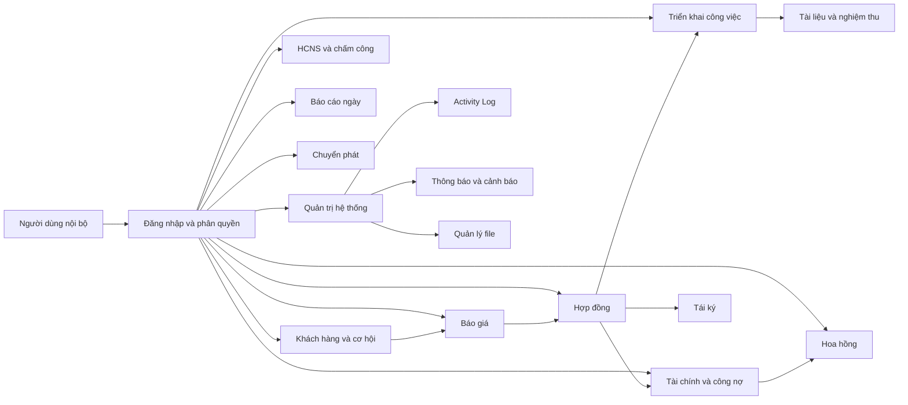

---

# 2. Luồng nghiệp vụ xuyên suốt

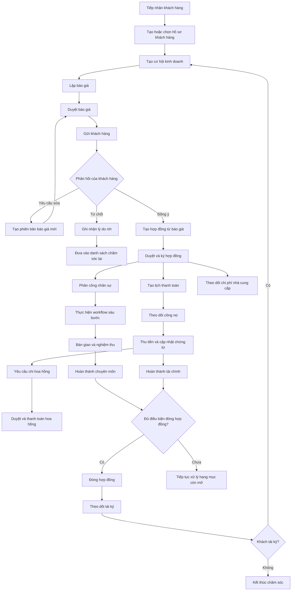

---

# 3. Luồng tiếp nhận khách hàng

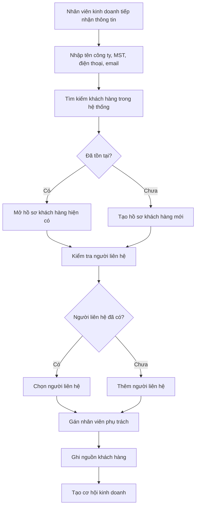

---

# 4. Luồng chống trùng khách hàng

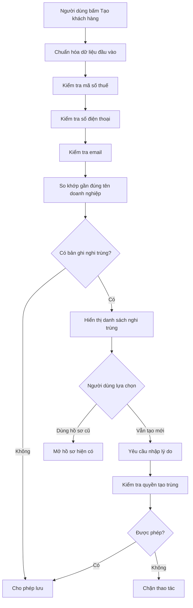

---

# 5. Pipeline cơ hội kinh doanh

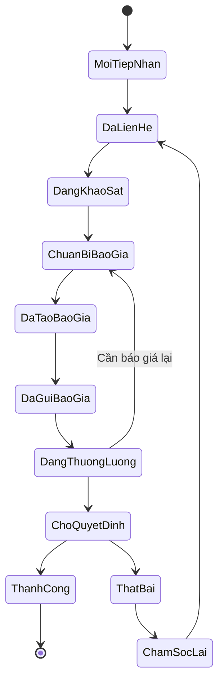

---

# 6. Luồng lập báo giá

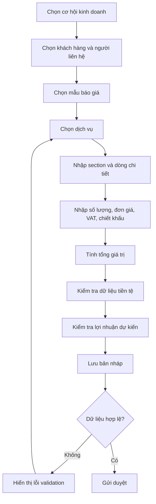

---

# 7. Luồng duyệt báo giá

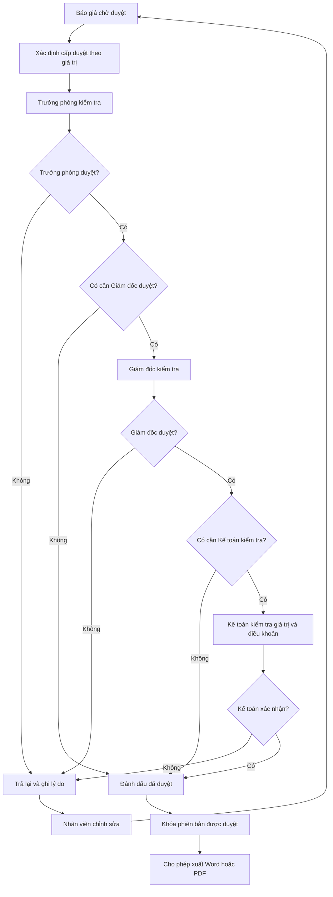

---

# 8. Vòng đời trạng thái báo giá

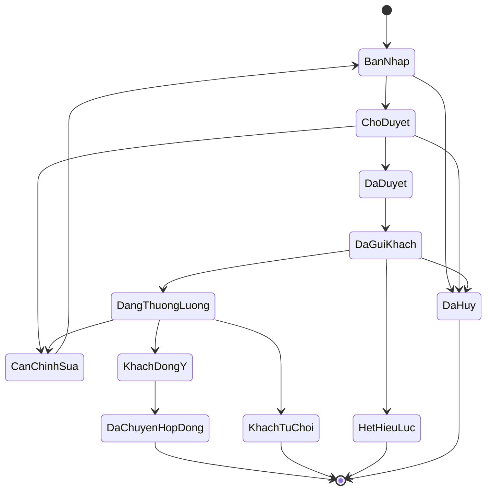

---

# 9. Luồng quản lý phiên bản báo giá

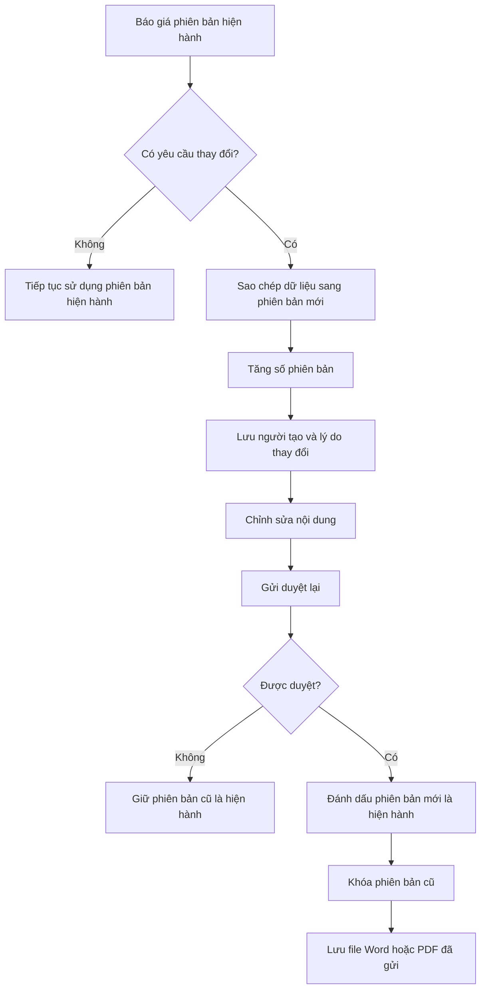

---

# 10. Luồng chuyển báo giá thành hợp đồng

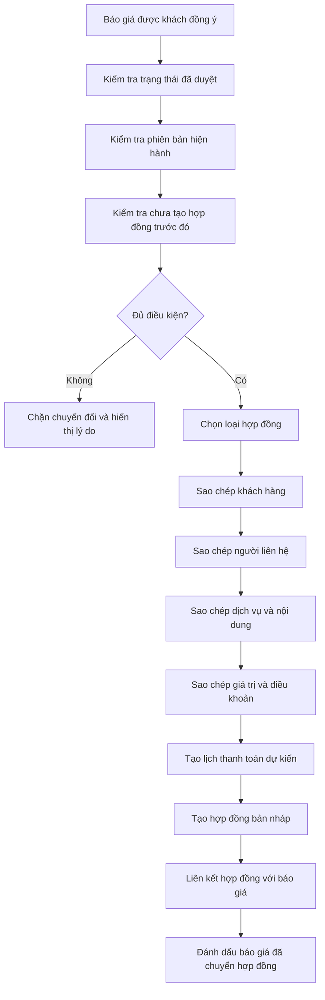

---

# 11. Luồng định tuyến loại hợp đồng

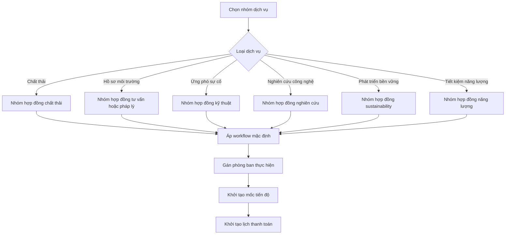

---

# 12. Luồng duyệt và ký hợp đồng

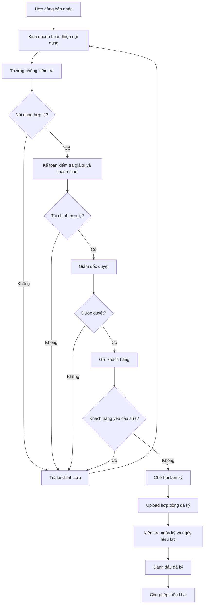

---

# 13. Vòng đời trạng thái hợp đồng

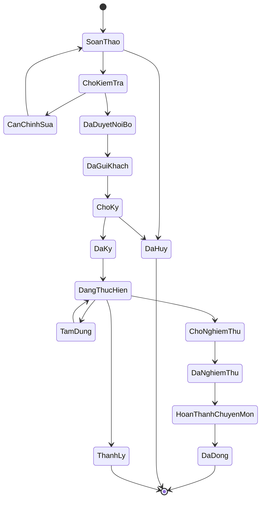

---

# 14. Luồng phân công thực hiện

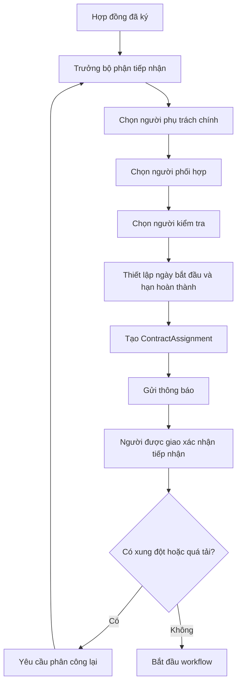

---

# 15. Workflow sáu bước hợp đồng

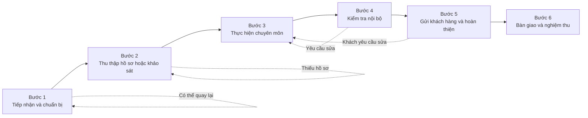

---

# 16. Vòng đời một bước workflow

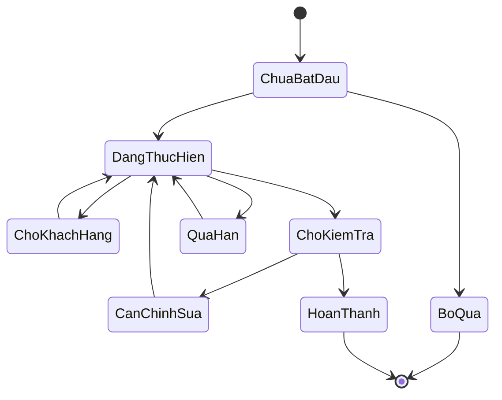

---

# 17. Luồng hồ sơ và tài liệu

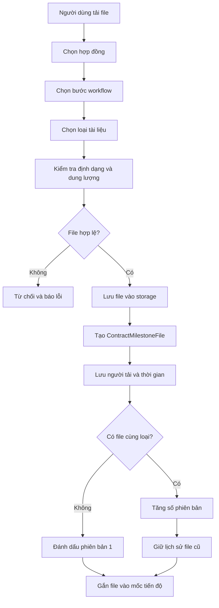

---

# 18. Luồng thanh toán và công nợ

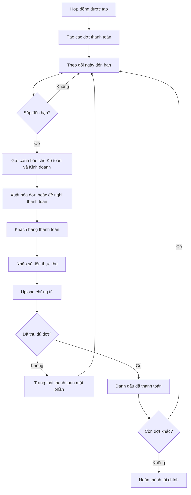

---

# 19. Luồng chi phí nhà cung cấp

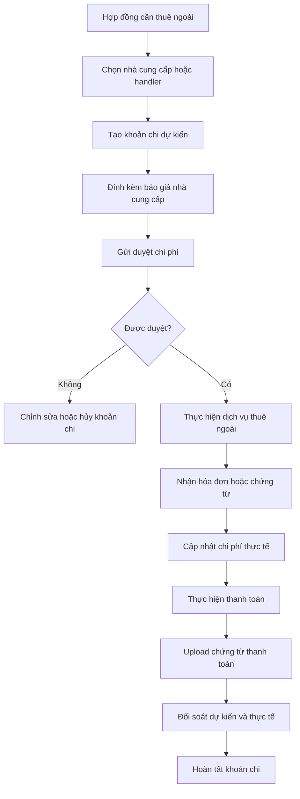

---

# 20. Luồng đồng bộ Google Sheet

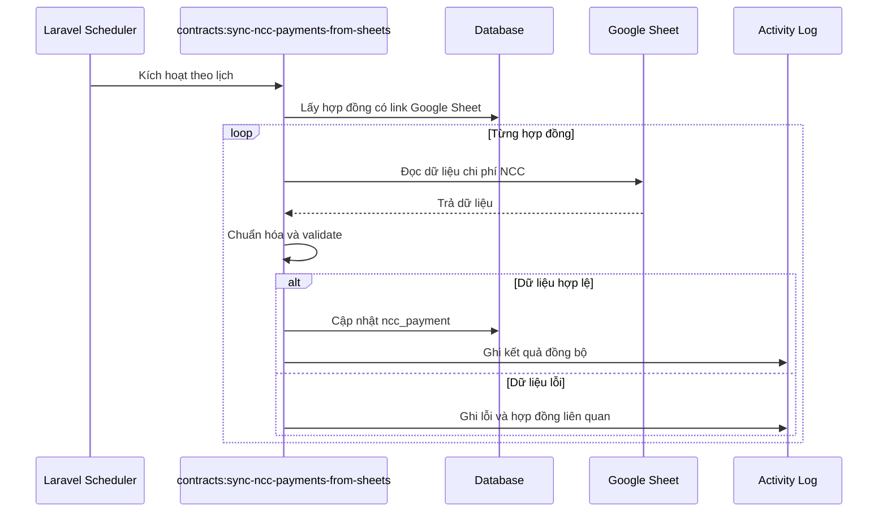

---

# 21. Luồng yêu cầu chi hoa hồng

```mermaid
flowchart TD
    A[Hợp đồng đủ điều kiện hoa hồng] --> B[Kinh doanh tạo yêu cầu]
    B --> C[Nhập người nhận, số tiền, tài khoản]
    C --> D[Kiểm tra trùng và giới hạn hoa hồng]
    D --> E{Hợp lệ?}

    E -->|Không| F[Hiển thị lỗi]
    E -->|Có| G[Gửi Trưởng phòng kiểm tra]

    G --> H{Trưởng phòng duyệt?}
    H -->|Không| I[Trả lại hoặc từ chối]
    H -->|Có| J[Gửi Giám đốc]

    J --> K{Giám đốc duyệt?}
    K -->|Không| I
    K -->|Có| L[Chuyển Kế toán]

    L --> M[Kế toán kiểm tra hồ sơ]
    M --> N[Tạo mã VietQR]
    N --> O[Kế toán thanh toán]
    O --> P[Upload chứng từ]
    P --> Q[Đánh dấu đã thanh toán]
```

---

# 22. Luồng đóng hợp đồng

```mermaid
flowchart TD
    A[Yêu cầu đóng hợp đồng] --> B[Kiểm tra workflow bắt buộc]
    B --> C[Kiểm tra hồ sơ bàn giao]
    C --> D[Kiểm tra biên bản nghiệm thu]
    D --> E[Kiểm tra công việc phân công]
    E --> F[Kiểm tra công nợ]
    F --> G[Kiểm tra khoản chi NCC]
    G --> H[Kiểm tra hoa hồng]

    H --> I{Đủ toàn bộ điều kiện?}
    I -->|Không| J[Liệt kê hạng mục còn thiếu]
    J --> K[Phân công người xử lý]
    K --> A

    I -->|Có| L[Khóa chỉnh sửa nghiệp vụ chính]
    L --> M[Đánh dấu hợp đồng đã đóng]
    M --> N[Chuyển sang theo dõi tái ký]
```

---

# 23. Luồng tái ký

```mermaid
flowchart TD
    A[Hợp đồng có ngày hết hạn] --> B{Còn 90 ngày?}
    B -->|Có| C[Tạo cảnh báo tái ký]
    C --> D[Gán kinh doanh phụ trách]
    D --> E[Liên hệ khách hàng]
    E --> F{Khách có nhu cầu?}

    F -->|Chưa quyết định| G[Đặt lịch chăm sóc lại]
    G --> E

    F -->|Không| H[Ghi lý do không tái ký]
    H --> I[Đánh dấu từ chối hoặc mất khách]

    F -->|Có| J[Tạo cơ hội mới]
    J --> K[Tạo báo giá mới]
    K --> L[Tạo hợp đồng mới]
    L --> M[Liên kết hợp đồng cũ và mới]
    M --> N[Đánh dấu đã tái ký]
```

---

# 24. Luồng chấm công

```mermaid
flowchart TD
    A[HCNS chọn file log máy chấm công] --> B[Kiểm tra định dạng file]
    B --> C{Đúng định dạng?}
    C -->|Không| D[Từ chối import]
    C -->|Có| E[Parse dữ liệu tab-separated]

    E --> F[Ánh xạ mã máy với nhân viên]
    F --> G{Có nhân viên không khớp?}
    G -->|Có| H[Hiển thị danh sách cần xử lý]
    G -->|Không| I[Chuẩn hóa thời gian quét]

    H --> I
    I --> J[Nhóm log theo nhân viên và ngày]
    J --> K[Tính giờ vào, giờ ra]
    K --> L[Tính đi muộn và về sớm]
    L --> M[Lưu attendance_logs]
    M --> N[Tổng hợp báo cáo]
    N --> O[Xuất Excel]
```

---

# 25. Luồng hồ sơ nhân sự

```mermaid
flowchart TD
    A[HCNS tạo hoặc mở hồ sơ nhân viên] --> B[Cập nhật thông tin cá nhân]
    B --> C[Cập nhật CCCD, MST, BHXH, tài khoản]
    C --> D[Tải tài liệu nhân sự]
    D --> E[Tạo hợp đồng lao động]
    E --> F[Kiểm tra ngày hiệu lực và hết hạn]
    F --> G[Trình duyệt nội bộ]
    G --> H{Được duyệt?}

    H -->|Không| I[Trả lại chỉnh sửa]
    I --> E
    H -->|Có| J[Đánh dấu hợp đồng có hiệu lực]
    J --> K[Theo dõi ngày hết hạn]
    K --> L{Sắp hết hạn?}
    L -->|Có| M[Gửi cảnh báo gia hạn]
    L -->|Không| K
```

---

# 26. Luồng báo cáo công việc hằng ngày

```mermaid
flowchart TD
    A[Đến 16:30] --> B[Scheduler kiểm tra báo cáo ngày]
    B --> C[Lấy danh sách nhân viên cần báo cáo]
    C --> D{Đã gửi báo cáo?}

    D -->|Có| E[Không nhắc]
    D -->|Chưa| F[Gửi Notification trong hệ thống]

    F --> G[Nhân viên mở form báo cáo]
    G --> H[Nhập công việc đã làm]
    H --> I[Nhập khó khăn và kế hoạch tiếp theo]
    I --> J[Gửi báo cáo]
    J --> K[Quản lý xem báo cáo]
    K --> L{Cần phản hồi?}
    L -->|Có| M[Quản lý bình luận hoặc yêu cầu bổ sung]
    L -->|Không| N[Hoàn tất]
```

---

# 27. Luồng chuyển phát Viettel Post

```mermaid
sequenceDiagram
    participant U as Người dùng
    participant APP as Hệ thống nội bộ
    participant VTP as Viettel Post API
    participant DB as Database

    U->>APP: Tạo yêu cầu chuyển phát
    APP->>APP: Validate người gửi, người nhận, hàng hóa
    APP->>VTP: Gửi yêu cầu tạo vận đơn
    alt API thành công
        VTP-->>APP: Mã vận đơn và phí
        APP->>DB: Lưu vận đơn
        APP-->>U: Hiển thị kết quả
    else API lỗi
        VTP-->>APP: Mã lỗi
        APP->>DB: Ghi log lỗi
        APP-->>U: Thông báo và cho phép thử lại
    end
```

---

# 28. Luồng thông báo và cảnh báo

```mermaid
flowchart TD
    A[Sự kiện nghiệp vụ] --> B{Loại sự kiện}

    B -->|Báo giá chờ duyệt| C[Thông báo người duyệt]
    B -->|Báo giá sắp hết hạn| D[Thông báo Kinh doanh]
    B -->|Hợp đồng đến hạn| E[Thông báo người phụ trách]
    B -->|Công việc quá hạn| F[Thông báo nhân viên và Trưởng phòng]
    B -->|Đợt thanh toán đến hạn| G[Thông báo Kế toán và Kinh doanh]
    B -->|Hoa hồng chờ xử lý| H[Thông báo cấp duyệt]
    B -->|Hợp đồng sắp tái ký| I[Thông báo Kinh doanh]
    B -->|Thiếu báo cáo ngày| J[Thông báo nhân viên]

    C --> K[Notification trong hệ thống]
    D --> K
    E --> K
    F --> K
    G --> K
    H --> K
    I --> K
    J --> K

    K --> L{Quá hạn chưa xử lý?}
    L -->|Không| M[Đánh dấu đã đọc hoặc đã xử lý]
    L -->|Có| N[Escalate lên cấp quản lý]
```

---

# 29. Luồng phân quyền truy cập

```mermaid
flowchart TD
    A[Người dùng truy cập chức năng] --> B[Kiểm tra đăng nhập]
    B --> C{Đã đăng nhập?}
    C -->|Không| D[Chuyển về trang đăng nhập]
    C -->|Có| E[Lấy vai trò người dùng]

    E --> F{Vai trò IT?}
    F -->|Có| G[Cho phép truy cập toàn hệ thống]
    F -->|Không| H[Kiểm tra permission]

    H --> I{Có permission?}
    I -->|Không| J[Trả về 403]
    I -->|Có| K[Kiểm tra phạm vi dữ liệu]

    K --> L{Loại phạm vi}
    L -->|Dữ liệu cá nhân| M[Chỉ dữ liệu do mình phụ trách]
    L -->|Dữ liệu phòng ban| N[Chỉ dữ liệu của phòng]
    L -->|Được phân công| O[Chỉ hợp đồng được giao]
    L -->|Toàn công ty| P[Cho phép toàn bộ]

    M --> Q[Thực hiện hành động]
    N --> Q
    O --> Q
    P --> Q
```

---

# 30. Luồng nhật ký hoạt động

```mermaid
sequenceDiagram
    participant U as Người dùng
    participant UI as Livewire hoặc Controller
    participant M as Model
    participant DB as Database
    participant AL as Activity Log

    U->>UI: Thêm, sửa hoặc xóa mềm dữ liệu
    UI->>UI: Kiểm tra quyền và validation
    UI->>M: Gọi thao tác dữ liệu
    M->>DB: Lưu thay đổi
    DB-->>M: Thành công
    M->>AL: Ghi actor, action, dirty values, thời gian
    AL-->>UI: Hoàn tất
    UI-->>U: Trả kết quả
```

---

# 31. Luồng xử lý ngoại lệ

```mermaid
flowchart TD
    A[Người dùng thực hiện thao tác] --> B[Authorization]
    B --> C{Có quyền?}
    C -->|Không| D[403 và ghi log]

    C -->|Có| E[Validation]
    E --> F{Dữ liệu hợp lệ?}
    F -->|Không| G[Hiển thị lỗi tại trường]

    F -->|Có| H[DB Transaction]
    H --> I[Thực hiện nhiều thao tác dữ liệu]
    I --> J{Có lỗi?}

    J -->|Không| K[Commit]
    K --> L[Ghi Activity Log]
    L --> M[Thông báo thành công]

    J -->|Có| N[Rollback]
    N --> O[Ghi error log]
    O --> P[Thông báo lỗi an toàn]
    P --> Q[Không lộ stack trace hoặc secret]
```

---

# 32. Sơ đồ dữ liệu tổng quan

```mermaid
erDiagram
    USERS ||--o{ QUOTATIONS : creates
    USERS ||--o{ DAILY_REPORTS : submits
    USERS ||--o{ CONTRACT_ASSIGNMENTS : assigned
    USERS ||--o{ COMMISSION_REQUESTS : creates

    CUSTOMERS ||--o{ QUOTATIONS : has
    CUSTOMERS ||--o{ CONTRACT_WASTES : owns
    CUSTOMERS ||--o{ CONTRACT_CONSULTINGS : owns
    CUSTOMERS ||--o{ CONTRACT_PROJECTS : owns
    CUSTOMERS ||--o{ CONTRACT_COMMERCIALS : owns
    CUSTOMERS ||--o{ CONTRACT_SUSTAINABILITIES : owns
    CUSTOMERS ||--o{ CONTRACT_ENERGIES : owns

    QUOTATIONS ||--o{ QUOTATION_DOCUMENTS : has
    QUOTATION_DOCUMENTS ||--o{ QUOTATION_DOCUMENT_SECTIONS : contains
    QUOTATION_DOCUMENT_SECTIONS ||--o{ QUOTATION_DOCUMENT_SECTION_ROWS : contains

    CONTRACT_WASTES ||--o{ CONTRACT_ASSIGNMENTS : morphs
    CONTRACT_CONSULTINGS ||--o{ CONTRACT_ASSIGNMENTS : morphs
    CONTRACT_PROJECTS ||--o{ CONTRACT_ASSIGNMENTS : morphs
    CONTRACT_COMMERCIALS ||--o{ CONTRACT_ASSIGNMENTS : morphs
    CONTRACT_SUSTAINABILITIES ||--o{ CONTRACT_ASSIGNMENTS : morphs
    CONTRACT_ENERGIES ||--o{ CONTRACT_ASSIGNMENTS : morphs

    CONTRACT_WASTES ||--o{ CONTRACT_WORKFLOW_STEPS : morphs
    CONTRACT_CONSULTINGS ||--o{ CONTRACT_WORKFLOW_STEPS : morphs
    CONTRACT_PROJECTS ||--o{ CONTRACT_WORKFLOW_STEPS : morphs
    CONTRACT_COMMERCIALS ||--o{ CONTRACT_WORKFLOW_STEPS : morphs
    CONTRACT_SUSTAINABILITIES ||--o{ CONTRACT_WORKFLOW_STEPS : morphs
    CONTRACT_ENERGIES ||--o{ CONTRACT_WORKFLOW_STEPS : morphs

    CONTRACT_WORKFLOW_STEPS ||--o{ CONTRACT_MILESTONE_FILES : has

    CONTRACT_WASTES ||--o{ CONTRACT_PAYMENT_SCHEDULES : morphs
    CONTRACT_CONSULTINGS ||--o{ CONTRACT_PAYMENT_SCHEDULES : morphs
    CONTRACT_PROJECTS ||--o{ CONTRACT_PAYMENT_SCHEDULES : morphs
    CONTRACT_COMMERCIALS ||--o{ CONTRACT_PAYMENT_SCHEDULES : morphs
    CONTRACT_SUSTAINABILITIES ||--o{ CONTRACT_PAYMENT_SCHEDULES : morphs
    CONTRACT_ENERGIES ||--o{ CONTRACT_PAYMENT_SCHEDULES : morphs

    CONTRACT_WASTES ||--o{ COMMISSION_REQUESTS : morphs
    CONTRACT_CONSULTINGS ||--o{ COMMISSION_REQUESTS : morphs
    CONTRACT_PROJECTS ||--o{ COMMISSION_REQUESTS : morphs
    CONTRACT_COMMERCIALS ||--o{ COMMISSION_REQUESTS : morphs
    CONTRACT_SUSTAINABILITIES ||--o{ COMMISSION_REQUESTS : morphs
    CONTRACT_ENERGIES ||--o{ COMMISSION_REQUESTS : morphs

    USERS ||--o{ EMPLOYEE_CONTRACTS : has
    USERS ||--o{ EMPLOYEE_DOCUMENTS : has
    ATTENDANCE_EMPLOYEES ||--o{ ATTENDANCE_LOGS : has
```

---

# 33. Sơ đồ trình tự từ báo giá đến hợp đồng

```mermaid
sequenceDiagram
    actor SALE as Kinh doanh
    participant Q as Quotation
    participant DOC as QuotationDocument
    participant APR as Người duyệt
    participant CUS as Khách hàng
    participant CON as Contract

    SALE->>Q: Tạo cơ hội
    SALE->>DOC: Soạn báo giá
    DOC->>APR: Gửi duyệt
    alt Yêu cầu chỉnh sửa
        APR-->>SALE: Trả lại kèm lý do
        SALE->>DOC: Tạo phiên bản mới
        DOC->>APR: Gửi duyệt lại
    else Được duyệt
        APR-->>DOC: Phê duyệt
        SALE->>CUS: Gửi Word hoặc PDF
    end

    alt Khách từ chối
        CUS-->>SALE: Từ chối
        SALE->>Q: Ghi lý do rớt
    else Khách đồng ý
        CUS-->>SALE: Xác nhận
        SALE->>CON: Tạo hợp đồng từ báo giá
        CON-->>SALE: Trả hợp đồng bản nháp
    end
```

---

# 34. Sơ đồ trình tự triển khai hợp đồng

```mermaid
sequenceDiagram
    actor SALE as Kinh doanh
    actor MAN as Trưởng bộ phận
    actor STAFF as Tư vấn hoặc Kỹ thuật
    actor ACC as Kế toán
    participant CON as Hợp đồng
    participant WF as Workflow
    participant FILE as Hồ sơ
    participant PAY as Lịch thanh toán

    SALE->>CON: Hoàn tất ký hợp đồng
    CON->>MAN: Thông báo tiếp nhận
    MAN->>CON: Tạo phân công
    CON->>STAFF: Thông báo nhiệm vụ
    STAFF->>WF: Bắt đầu bước 1
    STAFF->>FILE: Tải hồ sơ theo mốc
    STAFF->>WF: Cập nhật tiến độ

    loop Sáu bước
        STAFF->>WF: Thực hiện bước
        MAN->>WF: Kiểm tra
        alt Cần chỉnh sửa
            MAN-->>STAFF: Trả lại
        else Hoàn thành
            MAN->>WF: Phê duyệt bước
        end
    end

    ACC->>PAY: Theo dõi đợt thanh toán
    STAFF->>FILE: Tải biên bản nghiệm thu
    MAN->>CON: Xác nhận hoàn thành chuyên môn
```

---

# 35. Sơ đồ trình tự thu tiền và chi hoa hồng

```mermaid
sequenceDiagram
    actor SALE as Kinh doanh
    actor ACC as Kế toán
    actor DIR as Giám đốc
    participant PAY as PaymentSchedule
    participant COM as CommissionRequest
    participant QR as VietQR
    participant DB as Database

    PAY->>ACC: Cảnh báo đến hạn
    ACC->>PAY: Cập nhật hóa đơn và đề nghị thanh toán
    ACC->>PAY: Ghi nhận tiền khách trả
    PAY->>DB: Cập nhật số đã thu

    SALE->>COM: Tạo yêu cầu chi hoa hồng
    COM->>DIR: Gửi duyệt
    alt Từ chối
        DIR-->>SALE: Trả lý do
    else Đồng ý
        DIR->>COM: Phê duyệt
        COM->>ACC: Chuyển xử lý
        ACC->>QR: Tạo mã thanh toán
        QR-->>ACC: Trả mã QR
        ACC->>COM: Xác nhận đã thanh toán
        COM->>DB: Lưu chứng từ và trạng thái
    end
```
